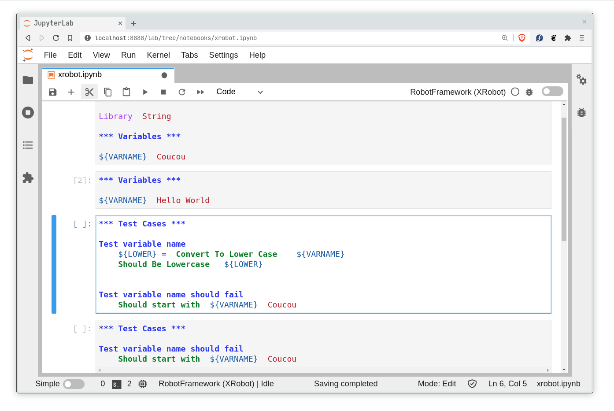
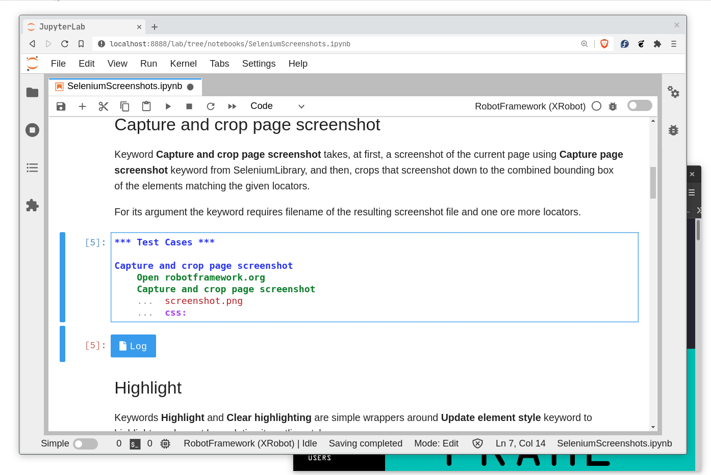
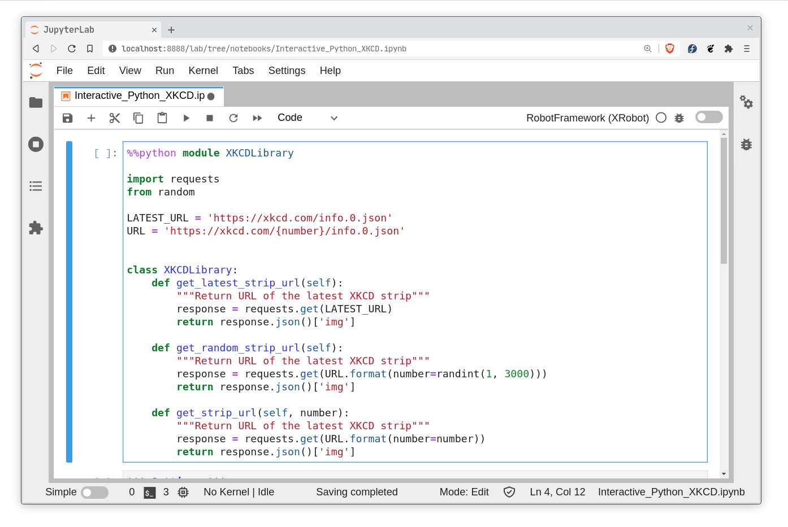
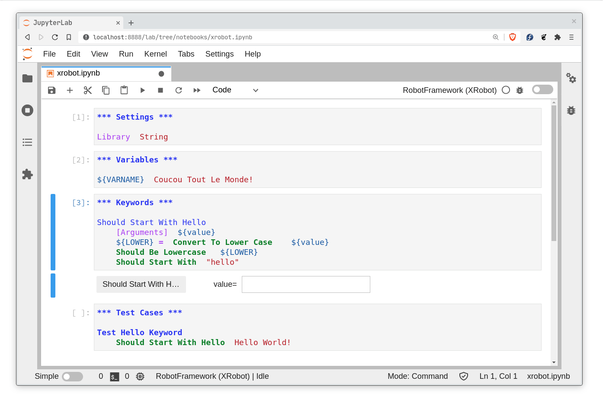
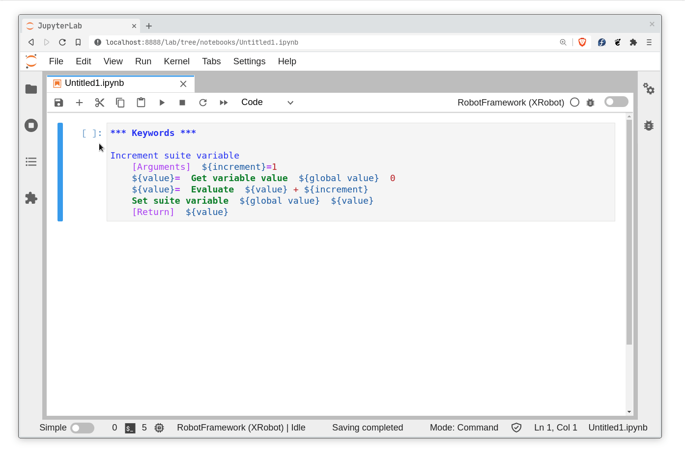

[](https://dev.azure.com/jupyter-xeus/jupyter-xeus/_build/latest?definitionId=3&branchName=master)
[](https://mybinder.org/v2/gh/jupyter-xeus/xeus-robot/stable?urlpath=/lab/tree/notebooks/xrobot.ipynb)

`xeus-robot` is a Jupyter kernel for [Robot Framework](https://robotframework.org/) based on the native implementation of the Jupyter protocol [xeus](https://github.com/jupyter-xeus/xeus).

## Installation

### Using mamba (or conda)

```bash
mamba install -c conda-forge xeus-robot
```

### Using pip

Depending on the platform, PyPI wheels may be available for xeus-robot.

```bash
pip install xeus-robot
```

### Installing from source

You can install `xeus-robot` from the sources, you first need to install its dependencies:

```bash
mamba install -c conda-forge xeus-python xtl cmake cppzmq nlohmann_json pybind11 pybind11_json robotframework-interpreter ipywidgets jupyterlab_robotmode
```

Then you can compile the sources (replace $CONDA_PREFIX with a custom installation prefix if need be)

```bash
mkdir build && cd build
cmake .. -D CMAKE_PREFIX_PATH=$CONDA_PREFIX -D CMAKE_INSTALL_PREFIX=$CONDA_PREFIX -D CMAKE_INSTALL_LIBDIR=lib -D PYTHON_EXECUTABLE=`which python`
make install
```

### Install the syntax highlighting and widgets for JupyterLab 1 and 2 (It is automatically installed for JupyterLab 3)

```bash
jupyter labextension install @marketsquare/jupyterlab_robotmode @jupyter-widgets/jupyterlab-manager
```

## Dependencies

``xeus-robot`` depends on

 - [xeus-python](https://github.com/jupyter-xeus/xeus-python)
 - [xtl](https://github.com/xtensor-stack/xtl)
 - [pybind11](https://github.com/pybind/pybind11)
 - [pybind11_json](https://github.com/pybind/pybind11_json)
 - [nlohmann_json](https://github.com/nlohmann/json)
 - [robotframework-interpreter](https://github.com/jupyter-xeus/robotframework-interpreter)
 - [robotframework-lsp](https://github.com/robocorp/robotframework-lsp)


| `xeus-robot`|  `xeus-python`  |      `xtl`      | `cppzmq` | `nlohmann_json` | `pybind11`     | `pybind11_json`   | `robotframework-interpreter` | `robotframework-lsp` |
|-------------|-----------------|-----------------|----------|-----------------|----------------|-------------------|------------------------------|----------------------|
|   master    |  >=0.15.2,<0.16 |  >=0.7.0,<0.8   |  ~4.7.1  |  >=3.6.1,<4.0   | >=2.6.1,<3.0   | >=0.2.6,<0.3      |  >=0.7.4,<0.8                |   >=1.7.0,<2         |
|   0.5.0     |  >=0.15.2,<0.16 |  >=0.7.0,<0.8   |  ~4.7.1  |  >=3.6.1,<4.0   | >=2.6.1,<3.0   | >=0.2.6,<0.3      |  >=0.7.4,<0.8                |   >=1.7.0,<2         |
|   0.4.4     |  >=0.13.5,<0.14 |  >=0.7.0,<0.8   |  ~4.7.1  |  >=3.6.1,<4.0   | >=2.6.1,<3.0   | >=0.2.6,<0.3      |  >=0.7.4,<0.8                |   >=0.14.0,<0.15.0   |
|   0.4.3     |  >=0.13.1,<0.14 |  >=0.7.0,<0.8   |  ~4.7.1  |  >=3.6.1,<4.0   | >=2.6.1,<3.0   | >=0.2.6,<0.3      |  >=0.7.4,<0.8                |   >=0.14.0,<0.15.0   |
|   0.4.2     |  >=0.13.1,<0.14 |  >=0.7.0,<0.8   |  ~4.7.1  |  >=3.6.1,<4.0   | >=2.6.1,<3.0   | >=0.2.6,<0.3      |  >=0.7.4,<0.8                |   >=0.14.0,<0.15.0   |
|   0.4.1     |  >=0.13.0,<0.14 |  >=0.7.0,<0.8   |  ~4.7.1  |  >=3.6.1,<4.0   | >=2.6.1,<3.0   | >=0.2.6,<0.3      |  >=0.7.3,<0.8                |   >=0.14.0,<0.15.0   |
|   0.4.0     |  >=0.13.0,<0.14 |  >=0.7.0,<0.8   |  ~4.7.1  |  >=3.6.1,<4.0   | >=2.6.1,<3.0   | >=0.2.6,<0.3      |  >=0.7.3,<0.8                |   >=0.14.0,<0.15.0   |
|   0.3.8     |  >=0.12.4,<0.13 |  >=0.7.0,<0.8   |  ~4.7.1  |  >=3.6.1,<4.0   | >=2.2.4,<3.0   | >=0.2.6,<0.3      |  >=0.7.3,<0.8                |   >=0.14.0,<0.15.0   |
|   0.3.7     |  >=0.12.4,<0.13 |  >=0.7.0,<0.8   |  ~4.7.1  |  >=3.6.1,<4.0   | >=2.2.4,<3.0   | >=0.2.6,<0.3      |  >=0.7.2,<0.8                |   >=0.14.0,<0.15.0   |
|   0.3.6     |  >=0.12.4,<0.13 |  >=0.7.0,<0.8   |  ~4.7.1  |  >=3.6.1,<4.0   | >=2.2.4,<3.0   | >=0.2.6,<0.3      |  >=0.7.0,<0.8                |   >=0.14.0,<0.15.0   |
|   0.3.5     |  >=0.12.4,<0.13 |  >=0.7.0,<0.8   |  ~4.7.1  |  >=3.6.1,<4.0   | >=2.2.4,<3.0   | >=0.2.6,<0.3      |  >=0.6.8,<0.7                |   >=0.14.0,<0.15.0   |
|   0.3.4     |  >=0.12.4,<0.13 |  >=0.7.0,<0.8   |  ~4.7.1  |  >=3.6.1,<4.0   | >=2.2.4,<3.0   | >=0.2.6,<0.3      |  >=0.6.6,<0.7                |   >=0.14.0,<0.15.0   |
|   0.3.3     |  >=0.12.1,<0.13 |  >=0.7.0,<0.8   |  ~4.7.1  |  >=3.6.1,<4.0   | >=2.2.4,<3.0   | >=0.2.6,<0.3      |  >=0.6.6,<0.7                |   >=0.14.0,<0.15.0   |
|   0.3.2     |  >=0.12.1,<0.13 |  >=0.7.0,<0.8   |  ~4.7.1  |  >=3.6.1,<4.0   | >=2.2.4,<3.0   | >=0.2.6,<0.3      |  >=0.6.6,<0.7                |   >=0.4.2,<0.5       |
|   0.3.1     |  >=0.11.3,<0.12 |  >=0.7.0,<0.8   |  ~4.7.1  |  >=3.6.1,<4.0   | >=2.2.4,<3.0   | >=0.2.6,<0.3      |  >=0.6.3,<0.7                |   >=0.4.2,<0.5       |
|   0.3.0     |  >=0.11.1,<0.12 |  >=0.7.0,<0.8   |  ~4.7.1  |  >=3.6.1,<4.0   | >=2.2.4,<3.0   | >=0.2.6,<0.3      |  >=0.6.3,<0.7                |   >=0.4.2,<0.5       |
|   0.2.2     |  >=0.10.2,<0.11 |  >=0.7.0,<0.8   |  ~4.7.1  |  >=3.6.1,<4.0   | >=2.2.4,<3.0   | >=0.2.6,<0.3      |  >=0.6.2,<0.7                |   >=0.4.2,<0.5       |
|   0.2.1     |  >=0.10.2,<0.11 |  >=0.7.0,<0.8   |  ~4.7.1  |  >=3.6.1,<4.0   | >=2.2.4,<3.0   | >=0.2.6,<0.3      |  >=0.6.2,<0.7                |   >=0.4.2,<0.5       |
|   0.2.0     |  >=0.10.0,<0.11 |  >=0.7.0,<0.8   |  ~4.7.1  |  >=3.6.1,<4.0   | >=2.2.4,<3.0   | >=0.2.6,<0.3      |  >=0.6.2,<0.7                |   >=0.4.2,<0.5       |


## Examples

### Code completion


### Code completion using Selenium selectors


### Custom RobotFramework library in Python


### Debugger support in JupyterLab 3


### Custom Keywords testing

